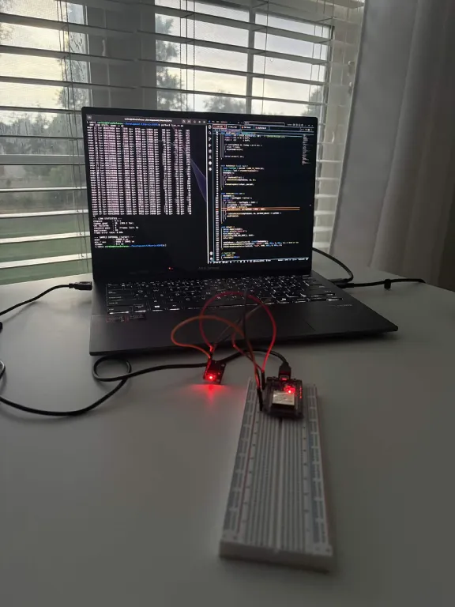
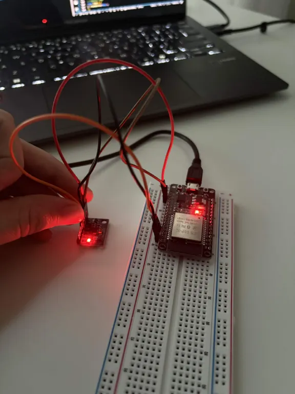

# ESP32 + MPU6050 Project

An ESP32 samples an MPU6050 IMU at 100 Hz on a dedicated FreeRTOS task, packages
each sample into a fixed-size framed packet (sync word, sequence number,
payload, CRC-16), and streams it over UART. A Python host script re-syncs on
the byte stream, validates every frame, detects dropped/duplicate frames,
tracks live link health (UP / DEGRADED / DOWN), and reports final statistics.

The firmware also has a built-in test mode that deliberately corrupts frames
on a timer, so the error-detection logic isn't just assumed to work — it's
proven against real, injected errors.

## Hardware

| MPU6050 pin | ESP32 pin | Note |
|---|---|---|
| VCC | 3V3 | Not 5V |
| GND | GND | |
| SDA | GPIO 21 | |
| SCL | GPIO 22 | |
| AD0 | GND | Sets I2C address to 0x68 |

## Frame format — 24 bytes

```
Offset  Size  Field    Description
0       2     SYNC     0xAA 0x55 — used to re-find frame boundaries
2       1     LEN      payload length (always 18)
3       1     SEQ      wraps 0-255, used to detect loss
4       18    PAYLOAD  4-byte timestamp + 7x int16 sensor values
22      2     CRC16    CRC-16-CCITT over LEN+SEQ+PAYLOAD
```

## Running it

**Firmware:**
```
pio run --target upload
```

**Host receiver** 

`pip install -r requirements.txt`:

```
python3 link_rx.py /dev/ttyUSB0
```
Ctrl+C prints a final stats report.

## Stats (CRC, Link stats, Jitter):


Every 5 seconds the firmware flips into "corrupt mode" and flips one bit in
1-of-10 outgoing frames — after the CRC is already computed, so it's a real
simulated transmission error. The receiver's job is to catch every one of
them without ever flagging a clean frame.

Measured result from a live run:


```
--- LINK STATISTICS ---
elapsed        : 15.6 s
frames good    : 1499  (95.8 fps)
CRC failures   : 65
sequence gaps  : 64  (frames lost: 64)
duplicates     : 0
frame error rate: 4.16%

--- SAMPLE INTERVAL (jitter) ---
mean           : 10427.2 us
min / max      : 9999 / 20001 us
stddev         : 2023.0 us
```

Every injected error was caught by the CRC (65 failures line up with the
64 sequence gaps that follow them), zero clean frames were ever flagged, and
zero duplicates. The jitter mean/max are pulled up by the dropped-frame
windows (a missed sample reads as ~20000us, double the 10000us period) —
the underlying sample timing itself holds a steady 9999-10000us baseline.

## Known limitations

- Detection only — no forward error correction or retransmission.
- No authentication/encryption on the link.
- Fixed 115200 baud.
- 8-bit sequence number wraps every 256 frames.

## Bench setup





